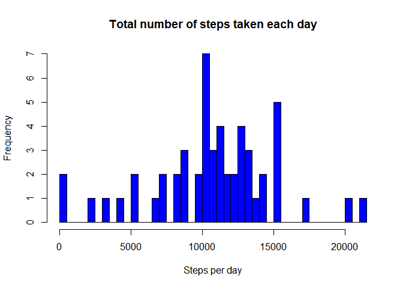
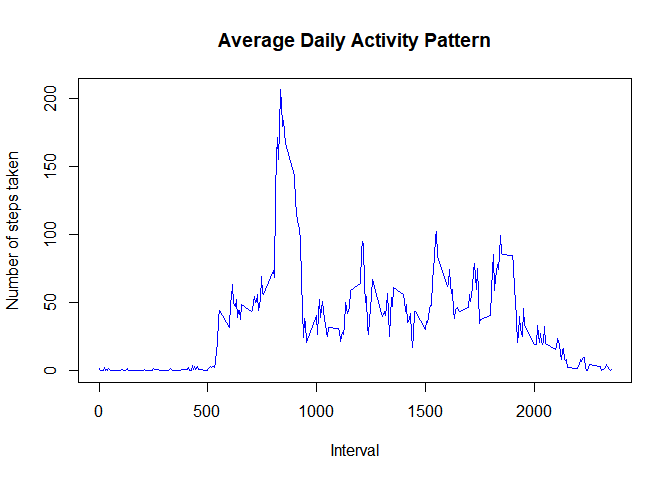
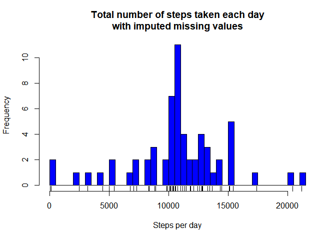
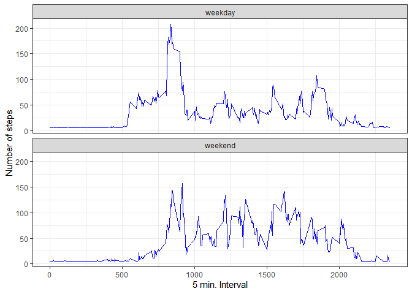

## Loading and preprocessing the data

```r
setwd('F:\\R\\datasciencecoursera\\RepData_PeerAssessment1')
df<-read.csv('activity/activity.csv',header=TRUE)
df[['date']]<- as.Date(df[['date']])
```

## What is mean total number of steps taken per day?

```r
perday<-aggregate(steps~date,data=df,sum)

hist(perday[['steps']], breaks = length(perday[['date']]), angle = 45, col ="blue",xlab = "Steps per day",main = "Total number of steps taken each day")
```

<!-- -->

Mean and Median steps

```r
summary(perday$steps)[3:4]
```

```
##   Median     Mean 
## 10765.00 10766.19
```

## What is the average daily activity pattern?

```r
meaninterval <- aggregate(steps ~ interval, data = df, FUN=mean, na.rm=TRUE)

with( meaninterval, plot(x = interval, y = steps, type ="l", col = "blue",
                          main = "Average Daily Activity Pattern",
                          xlab = "Interval",
                          ylab = "Number of steps taken"))
```

<!-- -->
Which 5-minute interval, on average across all the days in the dataset, contains the maximum number of steps

```r
max= meaninterval[which.max(meaninterval$steps),]
print(max)
```

```
##     interval    steps
## 104      835 206.1698
```
## Imputing missing values

```r
summary(df$steps)[7]
```

```
## NA's 
## 2304
```
Replacing NA with mean

```r
imputedSteps <- df
mean<-mean(imputedSteps$steps,na.rm = TRUE)
imputedSteps[which(is.na(imputedSteps$steps)), "steps"] <- mean
```

Plotting Imputed dataframe

```r
daySteps2 <- aggregate(steps ~ date, data = imputedSteps, FUN=sum)

hist(daySteps2$steps, breaks = length(daySteps2$date), angle = 45, col = "blue",
     xlab = "Steps per day",
     main = "Total number of steps taken each day\nwith imputed missing values")
rug(daySteps2$steps)
```

<!-- -->

Mean and Median of Imputed dataframe

```r
summary(daySteps2$steps)[3:4]
```

```
##   Median     Mean 
## 10766.19 10766.19
```


## Are there differences in activity patterns between weekdays and weekends?

```r
imputedSteps$daytype <- NULL

for(i in 1:nrow(imputedSteps)){
      # Check if weekday is 6 or 7 (Weekend)
      if(format(imputedSteps[i,2], "%u") %in% c("6","7")){
            imputedSteps[i,"daytype"] <- "weekend" 
      } else {
            imputedSteps[i,"daytype"] <- "weekday" 
      }
}

imputedSteps$daytype <- as.factor(imputedSteps$daytype)
```


```r
daytypeStepsInterval <- aggregate(imputedSteps$steps, 
                                  by = list(interval = imputedSteps$interval,                                                                daytype =imputedSteps$daytype),
                                  FUN=mean)

library(ggplot2)

ggplot(daytypeStepsInterval, aes(x=interval, y=x)) + 
        geom_line(color="blue") + 
        facet_wrap(~ daytype, nrow=2, ncol=1) +
        labs(x="5 min. Interval", y="Number of steps")  + theme_bw()
```

<!-- -->
